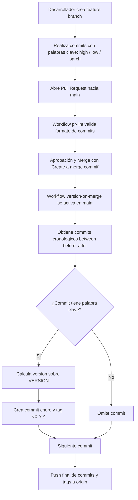

# Versionamiento Automático por Commits

Sistema de versionado semántico automatizado mediante **GitHub Actions**. Permite que cada desarrollador declare el impacto de sus cambios en sus mensajes de commit; al fusionarse a la rama principal (`main`), el bot calcula la versión incremental, actualiza el archivo `VERSION`, genera los commits correspondientes y publica los tags de Git en el orden cronológico exacto.

---

## 📋 Convención y Formato de Commits

Para que un commit dispare un incremento de versión, debe seguir la siguiente estructura:

```text
tipo(modulo): <palabra_clave> [X.Y.Z] descripcion del cambio
```

### Componentes:
- **`tipo`**: Clase de cambio bajo Conventional Commits (`feat`, `fix`, `refactor`, `perf`, `docs`, `chore`, etc.).
- **`(modulo)`**: *(Opcional)* Alcance o módulo del sistema afectado (ej. `(auth)`, `(billing)`, `(M01)`).
- **`<palabra_clave>`**: Determina qué segmento de la versión se incrementará (`high`, `low`, `parch`).
- **`[X.Y.Z]`**: Segmento numérico referencial que acompaña a la palabra clave. **Nota:** Este número es meramente ilustrativo y documental dentro del commit; el bot calcula la versión real a partir del archivo `VERSION`.
- **`descripcion`**: Explicación breve y clara del cambio realizado.

---

## 🏷️ Palabras Clave y Efecto en la Versión

| Palabra Clave | Tipo de Cambio | Efecto en SemVer (`MAJOR.MINOR.PATCH`) | Ejemplo de Commit |
|---|---|---|---|
| `high [X.Y.Z]` | Breaking Change / Cambio mayor de arquitectura | Incrementa **MAJOR** y reinicia `MINOR` y `PATCH` a `0`. Ej: `3.12.4` → `4.0.0` | `feat(auth): high [1.0.0] refactorizar flujo oauth con breaking change` |
| `low [X.Y.Z]` | Nueva funcionalidad / Feature / Mejora | Incrementa **MINOR** y reinicia `PATCH` a `0`. Ej: `3.12.4` → `3.13.0` | `feat(api): low [0.1.0] agregar endpoint de busqueda avanzada` |
| `parch [X.Y.Z]` | Corrección de bug / Hotfix / Parche menor | Incrementa **PATCH** manteniendo `MAJOR` y `MINOR`. Ej: `3.12.4` → `3.12.5` | `fix(ui): parch [0.0.1] solucionar desbordamiento en modal` |

> [!NOTE]
> Por conveniencia y robustez, el sistema también acepta `patch` como sinónimo de `parch`.

---

## ⚠️ Regla Crítica: Estrategia de Fusión de Pull Requests

El sistema versiona **commit por commit** preservando la trazabilidad de cada cambio dentro de la rama. Por lo tanto:

- ✅ **Create a merge commit (`--no-ff`)**: **RECOMENDADO.** Conserva todos los commits individuales de la rama más el commit de merge.
- ✅ **Rebase and merge**: **COMPATIBLE.** Reescribe los commits individuales en la base de `main`.
- ❌ **Squash and merge**: **ESTRICTAMENTE PROHIBIDO.** Colapsa todos los commits en un único commit, impidiendo que el bot procese los tags individuales y desincronizando el historial.

---

## ⚙️ ¿Cómo Funciona la Automatización?



1. **Evento Push en `main`**: Al completarse el merge, GitHub Actions detecta el rango de commits entrantes mediante `github.event.before` y `github.event.after`.
2. **Inspección Cronológica**: Se analizan los commits en orden (`git rev-list --reverse`).
3. **Cálculo de Versión**: Si el commit contiene `high`, `low` o `parch`, se actualiza el archivo `VERSION` y se genera un commit (`chore(version-bump): X.Y.Z`) junto a un tag anotado (`vX.Y.Z`).
4. **Push Atómico**: Una vez procesados todos los commits del lote, se realiza un único push de los commits de versión y todos los tags creados.

---

## 📁 Archivos Clave del Repositorio

- [`VERSION`](file:///home/patrickortiz/PycharmProjects/Versionamiento/VERSION): Almacena la versión semántica actual del proyecto (ej. `0.0.0`).
- [`.github/workflows/version-on-merge.yml`](file:///home/patrickortiz/PycharmProjects/Versionamiento/.github/workflows/version-on-merge.yml): Workflow principal de versionado automático al fusionar en `main`.
- [`.github/workflows/pr-lint.yml`](file:///home/patrickortiz/PycharmProjects/Versionamiento/.github/workflows/pr-lint.yml): Workflow de verificación previa que valida la sintaxis de commits en Pull Requests.
- [`documentacion-versionado.md`](file:///home/patrickortiz/PycharmProjects/Versionamiento/documentacion-versionado.md): Especificación y diseño técnico detallado de la arquitectura de versionado.
- [`prompt-agente-versionado.md`](file:///home/patrickortiz/PycharmProjects/Versionamiento/prompt-agente-versionado.md): Prompt maestro y requisitos de implementación para agentes de IA.
