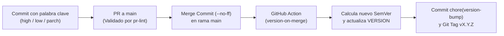

# Documentación — Automatización de Versionado por Commits

## 1. Objetivo

Eliminar la actualización manual del número de versión del proyecto y la creación manual de tags de Git. Los desarrolladores únicamente deben incluir una palabra clave de versión dentro del mensaje de su commit; un flujo automatizado de GitHub Actions interpreta dicha palabra, calcula el incremento semántico correspondiente (`MAJOR`, `MINOR` o `PATCH`), actualiza el archivo `VERSION`, deja constancia en un commit específico de versión y publica el tag de Git anotado en orden cronológico exacto.



---

## 2. Formato de Commit Requerido

Todo commit que pretenda disparar un cambio de versión debe seguir la siguiente estructura:

```text
tipo(modulo): <palabra_clave> [X.Y.Z] descripcion del cambio
```

### Ejemplos Reales:
```text
feat(auth): high [1.0.0] cambio de arquitectura en autenticacion oauth2
feat(usuarios): low [0.1.0] agregar validacion de formulario de registro
fix(perfil): parch [0.0.1] corregir typo en mensaje de error al subir avatar
```

### Desglose de Campos:
- **`tipo`**: Clase de cambio bajo Conventional Commits (`feat`, `fix`, `refactor`, `perf`, `docs`, `chore`, etc.).
- **`modulo`**: (Opcional) Identificador del módulo o área del sistema afectada (ej. `(auth)`, `(M01)`).
- **`palabra_clave`**: `high`, `low` o `parch` (también se admite `patch` como alias): determina inequívocamente qué segmento de la versión se incrementará.
- **`[X.Y.Z]`**: Segmento numérico que acompaña a la palabra clave con propósitos documentales y de legibilidad para los revisores del PR. **Importante:** El bot de versionado no utiliza este número para el cálculo; la versión real se incrementa matemáticamente a partir del archivo central `VERSION`.
- **`descripcion`**: Detalle sucinto y descriptivo del cambio implementado.

---

## 3. Palabras Clave y Semántica de Versionado

A diferencia de esquemas ambiguos que intentan inferir la versión directamente del texto del tag, este sistema utiliza palabras clave explícitas:

| Palabra clave | Significado | Efecto en la versión del proyecto | Ejemplo de Transición |
|---|---|---|---|
| `high [X.Y.Z]` | Cambio mayor / Breaking change | Incrementa el **MAJOR** y resetea `MINOR` y `PATCH` a `0`. | `3.13.4` → `4.0.0` |
| `low [X.Y.Z]` | Funcionalidad / Feature o mejora | Incrementa el **MINOR** y resetea `PATCH` a `0`. | `3.13.4` → `3.14.0` |
| `parch [X.Y.Z]` | Corrección / Bugfix o parche menor | Incrementa el **PATCH** manteniendo `MAJOR` y `MINOR`. | `3.13.4` → `3.13.5` |

> [!TIP]
> Por robustez operativa, la expresión regular del workflow acepta tanto `parch` como `patch` de forma indiferente (case-insensitive).

---

## 4. Extracción de la Palabra Clave mediante Expresión Regular

El workflow analiza el asunto (`subject`) de cada commit utilizando la siguiente expresión regular POSIX/PCRE:

```bash
KEYWORD=$(echo "$MSG" | grep -ioP '\b(high|low|parch|patch)(?=\s*\[[0-9]+\.[0-9]+\.[0-9]+\])' | head -n 1 | tr '[:upper:]' '[:lower:]' || true)
```

### Explicación Técnica:
- `\b`: Límite de palabra para prevenir coincidencias parciales dentro de otras palabras (ej. `highlight` no disparará `high`).
- `(high|low|parch|patch)`: Captura cualquiera de las palabras clave autorizadas.
- `(?=\s*\[[0-9]+\.[0-9]+\.[0-9]+\])`: *Lookahead positivo* que valida que inmediatamente después exista un espacio opcional seguido del patrón numérico `[X.Y.Z]`. Esto garantiza que la palabra esté asociada formalmente a una declaración de versión y no sea una coincidencia casual dentro de la descripción del commit.
- `head -n 1`: Toma la primera coincidencia en caso de repetición.
- `tr '[:upper:]' '[:lower:]'`: Normaliza a minúsculas para soportar variantes como `HIGH` o `Low`.
- `|| true`: Previene fallos del script si el commit no contiene ninguna palabra clave; en tal caso la variable `$KEYWORD` queda vacía y el commit se omite de forma segura.

---

## 5. Archivo Central de Versión (`VERSION`)

- Se ubica en la raíz del repositorio con el nombre [`VERSION`](file:///home/patrickortiz/PycharmProjects/Versionamiento/VERSION).
- Formato estricto: `MAJOR.MINOR.PATCH` (ej. `0.0.0`, `1.2.3`).
- Si el archivo no existe al momento de ejecutarse la acción por primera vez, el workflow lo inicializa automáticamente en `0.0.0`.
- El flujo valida la integridad del contenido antes de operar; si detecta datos corruptos o texto arbitrario, la ejecución se detiene con un mensaje de error explicativo para evitar inconsistencias en el historial.

---

## 6. Disparador del Flujo y Prevención de Ciclos Infinitos

- **Evento**: Se activa exclusivamente con eventos `push` hacia las ramas protegidas `main` y `master`.
- **Ramas secundarias**: Los commits en ramas de desarrollo o feature (`feature/*`, `fix/*`) no disparan versionado; el sistema únicamente reacciona cuando el trabajo se incorpora formalmente a la rama principal.
- **Protección contra loops infinitos**:
  - En la condición del job: `if: "!contains(github.event.head_commit.message, 'chore(version-bump)')"`.
  - En el script interno: se omite cualquier commit cuyo mensaje contenga la firma `chore(version-bump)`.
  - El token estándar de GitHub Actions (`GITHUB_TOKEN`) no dispara ejecuciones recursivas por diseño de la plataforma.

---

## 7. Estrategia de Fusión en Pull Requests (Merge vs Squash)

La preservación de los commits individuales en el historial de `main` es un requisito indispensable:

- **Create a merge commit (`--no-ff`)**: ✅ **Método estándar y recomendado.** Mantiene cada commit individual intacto dentro del historial más el commit de merge de GitHub.
- **Rebase and merge**: ✅ **Compatible.** Mantiene los commits individuales reescribiéndolos sobre la base de `main`.
- **Squash and merge**: ❌ **INCOMPATIBLE Y NO PERMITIDO.** Esta opción comprime todos los commits de la rama en un único commit genérico, impidiendo que el bot procese los commits individuales con sus respectivas palabras clave y tags.

---

## 8. Flujo Operativo Paso a Paso

1. El desarrollador crea su rama de trabajo (`feature/xyz`) desde `main`.
2. Realiza sus commits normales, incluyendo la palabra clave (`high`, `low` o `parch`) y el tag referencial `[X.Y.Z]` en aquellos commits donde corresponda versionar.
3. Abre un Pull Request hacia `main`. El workflow `.github/workflows/pr-lint.yml` analiza los commits y valida la sintaxis.
4. Tras la revisión y aprobación, el PR se fusiona seleccionando **"Create a merge commit"**.
5. GitHub emite el evento `push` en `main`, proveyendo las referencias `before` (estado previo) y `after` (nuevo estado).
6. El workflow `.github/workflows/version-on-merge.yml` determina el rango exacto de commits mediante `git rev-list --reverse before..after`.
7. Itera commit por commit en orden cronológico:
   - Si no posee palabra clave válida, lo omite silenciosamente (incluyendo el commit de merge generado por GitHub).
   - Si contiene una palabra clave válida, lee `VERSION`, calcula la nueva versión matemática según el nivel (`high`, `low`, `parch`), escribe el archivo `VERSION`, genera un commit dedicado:
     ```text
     chore(version-bump): <NUEVA_VERSION> (origen: <sha corto> - <mensaje original>)
     ```
     y crea un tag anotado:
     ```text
     v<NUEVA_VERSION>
     ```
8. Al culminar el análisis de todos los commits del rango, realiza un único `push` atómico de los commits de versión y todos los tags creados hacia el repositorio remoto.

---

## 9. Manejo de Casos Borde y Resiliencia

- **Primer push a una rama / Repositorio nuevo**: `before` se recibe como una cadena de ceros (`0000000000000000000000000000000000000000`). El workflow detecta esta condición y obtiene el historial completo hasta `after` sin generar errores.
- **Commits no versionados**: Commits de documentación, tareas auxiliares o merges sin etiquetas son ignorados sin detener el proceso ni alterar la versión.
- **Tags preexistentes**: Si un tag ya existe local o remotamente, se omite su recreación evitando fallos por colisión.
- **Concurrencia**: Se implementa un grupo de concurrencia (`concurrency: version-bump-${{ github.ref }}`) con `cancel-in-progress: false` para asegurar que múltiples fusiones consecutivas se procesen secuencialmente y sin condiciones de carrera.

---

## 10. Implementación y Mejoras Realizadas

- [x] **Workflow de Versionado**: [`.github/workflows/version-on-merge.yml`](file:///home/patrickortiz/PycharmProjects/Versionamiento/.github/workflows/version-on-merge.yml).
- [x] **Workflow de Validación Previa (PR Lint)**: [`.github/workflows/pr-lint.yml`](file:///home/patrickortiz/PycharmProjects/Versionamiento/.github/workflows/pr-lint.yml), que valida la sintaxis de los commits en los Pull Requests antes de permitir la fusión.
- [x] **Archivo de Versión Inicial**: [`VERSION`](file:///home/patrickortiz/PycharmProjects/Versionamiento/VERSION) inicializado en `0.0.0`.
- [x] **Documentación de Usuario**: [`README.md`](file:///home/patrickortiz/PycharmProjects/Versionamiento/README.md) completo con guía para desarrolladores y ejemplos interactivos.